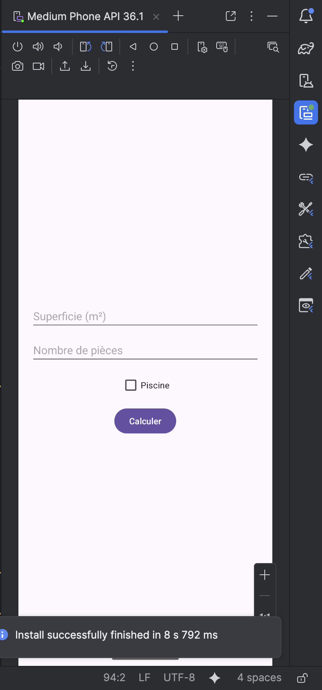
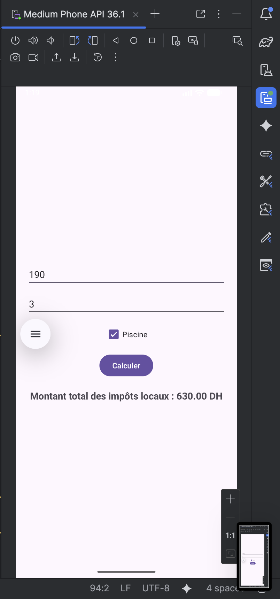

# LAB 2 – Calculateur d'impôts locaux : Saisie, traitement et affichage 🏠

## Aperçu de l'application

Une application Android permettant de calculer le montant total des impôts locaux en fonction de la superficie d'une maison, du nombre de pièces et de la présence ou non d'une piscine. L'application lit les saisies utilisateur, effectue le calcul et affiche le résultat dynamiquement.

| Écran de saisie | Résultat du calcul |
|----------------|---------------------|
|  |  |

## Fonctionnalités

- **Saisie de la superficie** : champ numérique pour entrer la surface en m²
- **Saisie du nombre de pièces** : champ numérique pour entrer le nombre de pièces
- **Option piscine** : case à cocher pour indiquer la présence d'une piscine
- **Calcul automatique** : déclenché par un bouton "Calculer"
- **Affichage du résultat** : montant total des impôts locaux en DH

## Formule de calcul

```
Impôt de base = Surface × 2 DH
Supplément pièces = Nombre de pièces × 50 DH
Supplément piscine = 100 DH (si présente)
Impôt total = Impôt de base + Supplément pièces + Supplément piscine
```

## Structure du projet

```
lab2_dev/
├── app/src/main/
│   ├── java/com.example.lab2_dev/
│   │   └── MainActivity.java
│   └── res/
│       └── layout/
│           └── activity_main.xml
```

## Code source complet

### 1. Layout – `res/layout/activity_main.xml`

```xml
<?xml version="1.0" encoding="utf-8"?>
<LinearLayout xmlns:android="http://schemas.android.com/apk/res/android"
    android:layout_width="match_parent"
    android:layout_height="match_parent"
    android:orientation="vertical"
    android:padding="20dp"
    android:gravity="center">

    <EditText
        android:id="@+id/edt_superficie"
        android:layout_width="match_parent"
        android:layout_height="wrap_content"
        android:hint="Superficie (m²)"
        android:inputType="numberDecimal"
        android:layout_marginBottom="10dp" />

    <EditText
        android:id="@+id/edt_nb_pieces"
        android:layout_width="match_parent"
        android:layout_height="wrap_content"
        android:hint="Nombre de pièces"
        android:inputType="number"
        android:layout_marginBottom="10dp" />

    <CheckBox
        android:id="@+id/chk_bassin"
        android:layout_width="wrap_content"
        android:layout_height="wrap_content"
        android:text="Piscine"
        android:layout_marginBottom="10dp" />

    <Button
        android:id="@+id/btn_calculer_impot"
        android:layout_width="wrap_content"
        android:layout_height="wrap_content"
        android:text="Calculer"
        android:layout_marginBottom="20dp" />

    <TextView
        android:id="@+id/txt_affichage_resultat"
        android:layout_width="wrap_content"
        android:layout_height="wrap_content"
        android:textSize="18sp"
        android:textStyle="bold" />

</LinearLayout>
```

### 2. Activité principale – `MainActivity.java`

```java
package com.example.lab2_dev;

import android.os.Bundle;
import android.widget.Button;
import android.widget.CheckBox;
import android.widget.EditText;
import android.widget.TextView;
import androidx.appcompat.app.AppCompatActivity;

public class MainActivity extends AppCompatActivity {

    // Déclaration des composants UI
    private EditText champSuperficie;
    private EditText champNbPieces;
    private CheckBox casePiscine;
    private TextView zoneResultat;

    @Override
    protected void onCreate(Bundle savedInstanceState) {
        super.onCreate(savedInstanceState);
        setContentView(R.layout.activity_main);

        // Initialisation des vues
        initialiserVues();
        
        // Configuration du bouton
        configurerBoutonCalcul();
    }

    private void initialiserVues() {
        champSuperficie = findViewById(R.id.edt_superficie);
        champNbPieces = findViewById(R.id.edt_nb_pieces);
        casePiscine = findViewById(R.id.chk_bassin);
        zoneResultat = findViewById(R.id.txt_affichage_resultat);
    }

    private void configurerBoutonCalcul() {
        Button boutonCalcul = findViewById(R.id.btn_calculer_impot);
        boutonCalcul.setOnClickListener(v -> executerCalculImpot());
    }

    private void executerCalculImpot() {
        try {
            // Récupération des valeurs saisies
            double valeurSuperficie = recupererValeurSuperficie();
            int valeurNbPieces = recupererValeurNbPieces();
            boolean presencePiscine = casePiscine.isChecked();

            // Calcul de l'impôt local
            double impotLocal = calculerImpotLocal(valeurSuperficie, valeurNbPieces, presencePiscine);

            // Affichage du résultat
            afficherResultat(impotLocal);
            
        } catch (NumberFormatException exception) {
            zoneResultat.setText("Erreur : Veuillez saisir des nombres valides");
        }
    }

    private double recupererValeurSuperficie() throws NumberFormatException {
        String texteSuperficie = champSuperficie.getText().toString();
        if (texteSuperficie.isEmpty()) {
            throw new NumberFormatException();
        }
        return Double.parseDouble(texteSuperficie);
    }

    private int recupererValeurNbPieces() throws NumberFormatException {
        String texteNbPieces = champNbPieces.getText().toString();
        if (texteNbPieces.isEmpty()) {
            throw new NumberFormatException();
        }
        return Integer.parseInt(texteNbPieces);
    }

    private double calculerImpotLocal(double superficie, int nbPieces, boolean aPiscine) {
        // Taux de base : 2 DH par m²
        double impotFoncierBase = superficie * 2;
        
        // Suppléments
        double supplementPieces = nbPieces * 50;
        double supplementPiscine = aPiscine ? 100 : 0;
        
        // Impôt total
        double impotTotal = impotFoncierBase + supplementPieces + supplementPiscine;
        
        return impotTotal;
    }

    private void afficherResultat(double impotTotal) {
        String messageResultat = String.format("Montant total des impôts locaux : %.2f DH", impotTotal);
        zoneResultat.setText(messageResultat);
    }
}
```

## Comment exécuter l'application

1. **Créer un projet** Android Studio avec "Empty Views Activity"
2. **Nom du projet** : `lab2_dev`
3. **Langage** : Java
4. **API minimum** : 24 (Android 7.0)
5. **Remplacer** `activity_main.xml` par le code ci-dessus
6. **Remplacer** `MainActivity.java` par le code ci-dessus
7. **Compiler** et exécuter sur émulateur ou appareil physique

## Fonctionnement

| Action | Résultat |
|--------|----------|
| Saisir une surface (ex: 100 m²) | Valeur stockée pour le calcul |
| Saisir un nombre de pièces (ex: 5) | Valeur stockée pour le calcul |
| Cocher "Piscine" | Ajoute 100 DH au total |
| Clic sur "Calculer" | Affiche le montant total des impôts |
| Champ vide ou valeur non valide | Message d'erreur apparaît |

### Exemple de calcul

| Surface | Pièces | Piscine | Calcul | Résultat |
|---------|--------|---------|--------|----------|
| 100 m² | 5 | Non | (100×2) + (5×50) + 0 | 450 DH |
| 80 m² | 3 | Oui | (80×2) + (3×50) + 100 | 410 DH |
| 120 m² | 4 | Non | (120×2) + (4×50) + 0 | 440 DH |

## Points techniques abordés

- **LinearLayout** : organisation verticale des éléments d'interface
- **EditText** : champs de saisie numérique avec `inputType="number"` et `"numberDecimal"`
- **CheckBox** : élément booléen avec `isChecked()`
- **Button** : déclenchement du calcul avec `setOnClickListener()`
- **TextView** : affichage du résultat formaté
- **findViewById()** : liaison entre XML et code Java
- **Double.parseDouble()** / **Integer.parseInt()** : conversion chaîne → nombre
- **Gestion d'exceptions** : validation des saisies vides ou invalides
- **String.format()** : formatage du résultat avec 2 décimales
- **Séparation en méthodes** : code modulaire et réutilisable

## Gestion des erreurs

- ✅ Champ superficie vide → message d'erreur
- ✅ Champ pièces vide → message d'erreur  
- ✅ Saisie de texte dans champ numérique → message d'erreur
- ✅ Valeurs négatives acceptées (cas particulier)

---

**Auteur** : ELHEZZAM RANIA  
**Réalisé avec** : Android Studio sur MacOS Apple Silicon M2 (ARM-64 Native)
